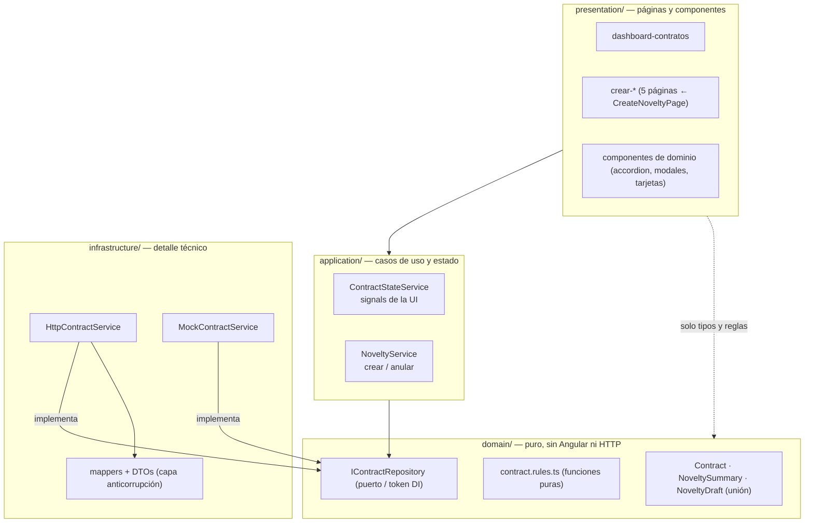
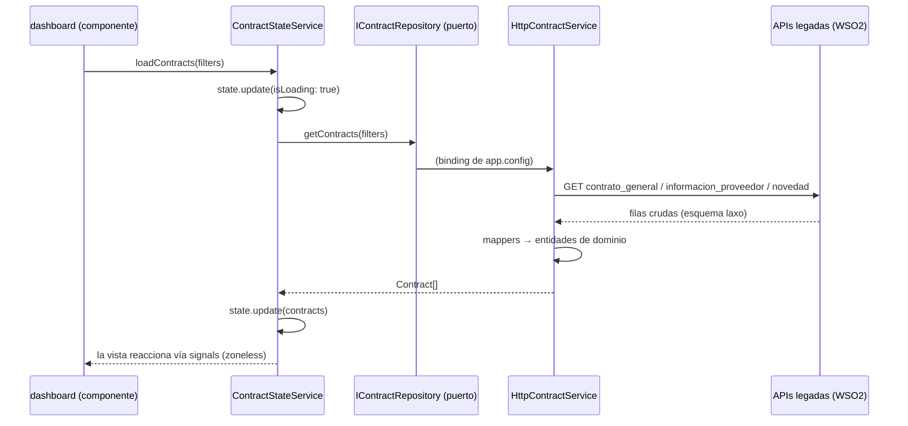
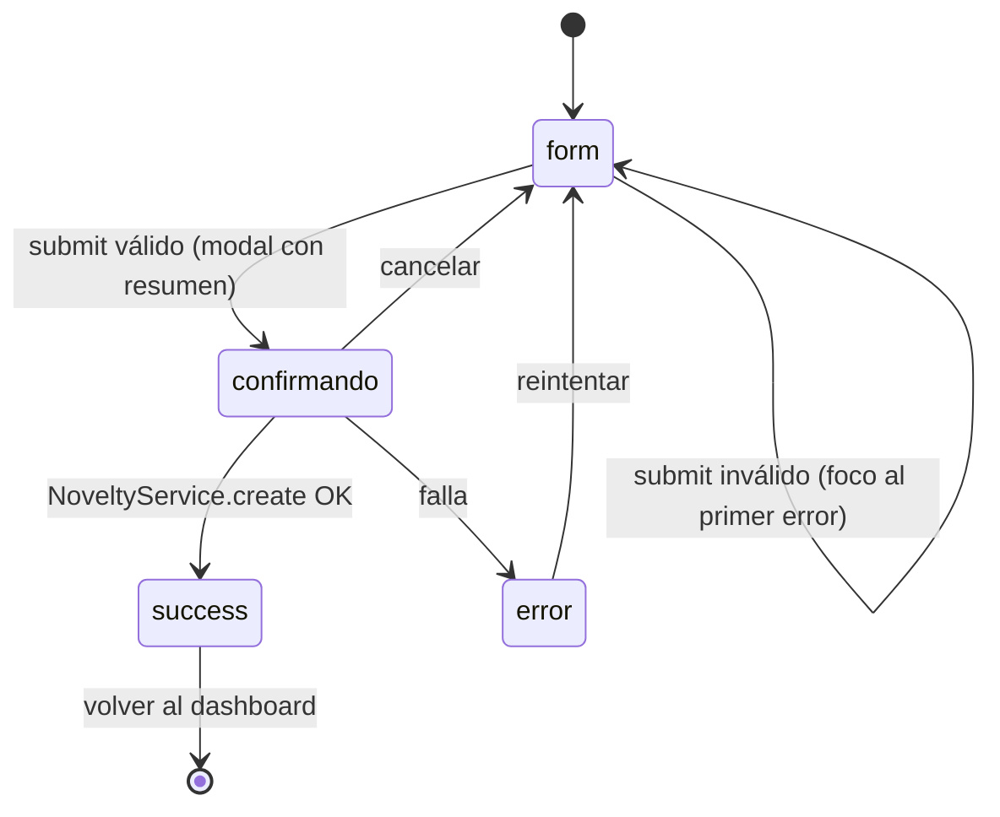

# Arquitectura

## Principios rectores

1. **El dominio no conoce a Angular ni al backend.** `domain/` contiene solo TypeScript puro: entidades, reglas y el puerto del repositorio. Puede testearse sin TestBed.
2. **La infraestructura es intercambiable.** La presentación y la aplicación dependen del puerto abstracto `IContractRepository`; qué implementación responde (HTTP real o mock) se decide en un único binding de `app.config.ts` ([ADR-005](adr/ADR-005-repositorio-como-puerto.md)).
3. **Estado unidireccional con signals.** Los componentes disparan acciones sobre servicios de aplicación y leen signals de solo lectura; nunca mutan estado ajeno ni se suscriben a stores propios ([ADR-006](adr/ADR-006-estado-con-signals.md)).
4. **Aislamiento frente al shell.** El MF comparte DOM con el root sin shadow DOM: ningún estilo global sin ámbito, zone.js delegado al root, base href propia ([ADR-002](adr/ADR-002-parcel-single-spa.md), [ADR-007](adr/ADR-007-tailwind-tokens.md)).
5. **Simplicidad sobre patrón.** No hay NgRx, facades genéricas ni abstracciones especulativas; cada pieza existe porque una vista la necesita hoy.

## Capas DDD

Un único dominio (`contratos`) implementa las 4 capas. Un dominio nuevo replicaría esta estructura como carpeta hermana bajo `domains/`.



**Regla de dependencia**: las flechas solo apuntan hacia adentro (presentación → aplicación → dominio ← infraestructura). La infraestructura conoce al dominio para implementarlo; el dominio no conoce a nadie.

| Capa | Puede importar | Nunca importa |
|---|---|---|
| `domain/` | nada del proyecto (solo RxJS para tipos `Observable` del puerto) | Angular, HttpClient, environments, DTOs |
| `application/` | `domain/` | `infrastructure/`, componentes |
| `infrastructure/` | `domain/` (para implementarlo), `environments`, `shared/util` | `application/`, `presentation/` |
| `presentation/` | `application/`, tipos y reglas de `domain/`, `shared/` | `infrastructure/` |

`shared/` (ui, util, http) es transversal y no pertenece a ninguna capa: no contiene lógica de negocio.

## Flujo de datos (lectura)



Claves del flujo:
- El **interceptor** (`shared/http/auth.interceptor.ts`) agrega `Authorization: Bearer` leyendo el token que el shell dejó en `localStorage` — solo hacia las APIs de la allowlist ([ADR-009](adr/ADR-009-autenticacion-delegada.md)).
- Los **mappers** absorben todas las rarezas del backend legado (campos alternativos, `[{}]` como "sin filas", envoltorio `{Code, Body}`) para que el dominio quede limpio; ver `infrastructure/mappers/contract.mapper.ts` y [DEVELOPMENT_GUIDE.md](DEVELOPMENT_GUIDE.md#cómo-consumir-un-endpoint-nuevo).
- Las **escrituras** (`createNovelty`, `annulNovelty`) siguen simuladas — estado actual en [MIGRATION.md](MIGRATION.md) y tarea MIG-001 del [MIGRATION_PLAN](../MIGRATION_PLAN.md).

## Flujo de creación de una novedad

Las 5 páginas comparten la máquina de estados de `CreateNoveltyPage` ([ADR-008](adr/ADR-008-clase-base-paginas-novedad.md)):



Cada página concreta solo define `noveltyName`, su `FormGroup`, `buildDraft()` (draft tipado de la unión `NoveltyDraft`) y `buildSummary()` (filas del modal).

## Navegación

Rutas lazy (`loadComponent`) definidas en `app.routes.ts`:

```
/                                                → dashboard (búsqueda + listado + anulación + activación)
/contratos/:contractId/novedades/…               → hijas bajo un padre con canActivate: [contractAccessGuard]
    adicion-prorroga | suspension | cesion | terminacion | reinicio | poliza
/**                                              → redirige al dashboard
```

`:contractId` es el id compuesto `${numero}_${vigencia}` (el backend no tiene id único de contrato). Qué opciones se ofrecen por contrato lo decide `contract-accordion` con el mapa estado→acciones de `domain/contract.rules.ts` (`availableActions`, alimentado por el estado real de `contrato_estado` con fallback inferido). `contractAccessGuard` (`shared/auth/`) redirige al dashboard a los usuarios cuyo único rol es SUPERVISOR sobre contratos que no supervisan. La página `poliza` no extiende `CreateNoveltyPage` (no crea una novedad: completa el registro de póliza de la última cesión vía PUT).

## Integración single-spa y ciclo de vida

```mermaid
sequenceDiagram
    participant R as Root (gestion_contractual_root_mf)
    participant M as novedades_mf (main.single-spa.ts)
    participant A as App Angular

    R->>M: import("…/main.js") — UMD registrado en el import map
    R->>M: bootstrap()
    R->>M: mount() al navegar a /novedades
    M->>M: crea el elemento <novedades-mf /> en el DOM del shell
    M->>A: bootstrapApplication(AppComponent, providers + APP_BASE_HREF='/novedades')
    A-->>R: UI activa; el router trata /novedades como base
    R->>M: unmount() al salir de la ruta
    M->>A: destruye la aplicación (single-spa-angular)
```

Piezas de la integración (todas en `main.single-spa.ts`, `angular.json`, `extra-webpack.config.js`):
- **Un solo entry point**: `main.single-spa.ts` exporta `bootstrap/mount/unmount` y además auto-arranca en modo standalone si `<novedades-mf>` existe en el DOM (solo ocurre con el `index.html` propio).
- **Build UMD** con `@angular-builders/custom-webpack` + `single-spa-angular/lib/webpack` (`libraryName: novedades-mf`).
- **`APP_BASE_HREF: '/novedades'`** solo en el bootstrap single-spa; sin él el router de Angular no reconoce el segmento del shell (NG04002).
- **zone.js no se empaqueta** (`polyfills: []`): el root lo provee por CDN para los MFs que lo necesiten; este MF es además zoneless ([ADR-003](adr/ADR-003-standalone-zoneless-signals.md)).
- **`deployUrl` por ambiente** en `angular.json`: los chunks lazy se resuelven contra la URL pública real de cada despliegue ([ADR-010](adr/ADR-010-deployurl-por-ambiente.md)).
- **Template sin `mat-typography`**: las reglas tipográficas del theme de Material pisarían las utilidades Tailwind al montarse en el shell (comentado en `main.single-spa.ts`).

## Comunicación con el exterior

| Canal | Mecanismo | Detalle |
|---|---|---|
| Shell → MF (auth) | `localStorage` (`access_token`/`id_token`) | Patrón oficial de los lineamientos (`shared.md`); el MF nunca inicia OAuth |
| MF → APIs | `HttpClient` + interceptor Bearer | Solo servicios declarados en `environments/` (nombres institucionales `*_SERVICE`) |
| Shell → MF (props) | No se usa | El subject de props del scaffold se eliminó por no tener consumidores; re-crear solo si aparece una necesidad real |

## Organización para crecer

- **Nuevo dominio de negocio** → carpeta hermana `domains/<nombre>/` con las mismas 4 capas; su repositorio se registra en `app.config.ts`.
- **Nueva novedad** → nueva página que extiende `CreateNoveltyPage` + nuevo miembro de la unión `NoveltyDraft` + ruta lazy. Receta paso a paso en [DEVELOPMENT_GUIDE.md](DEVELOPMENT_GUIDE.md#cómo-estructurar-un-feature-nuevo).
- **Nuevo átomo visual** → `shared/ui/` solo si es agnóstico del dominio; si habla de contratos/novedades, vive en `presentation/components/`.
